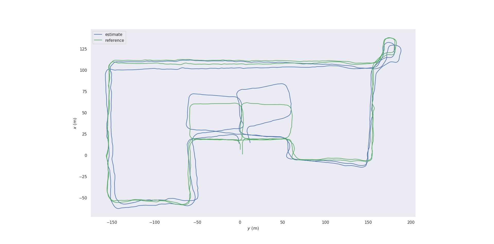
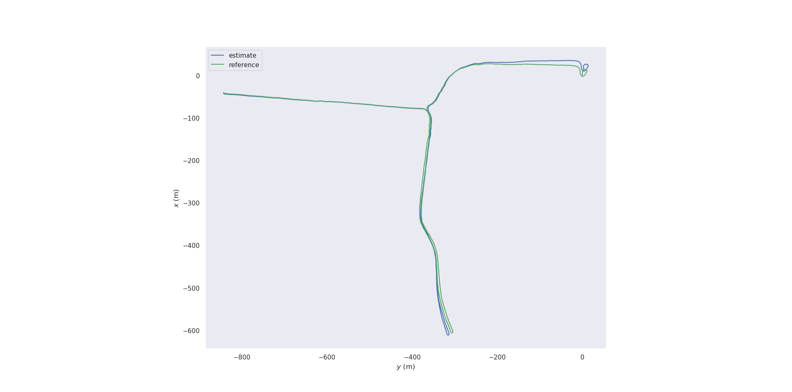
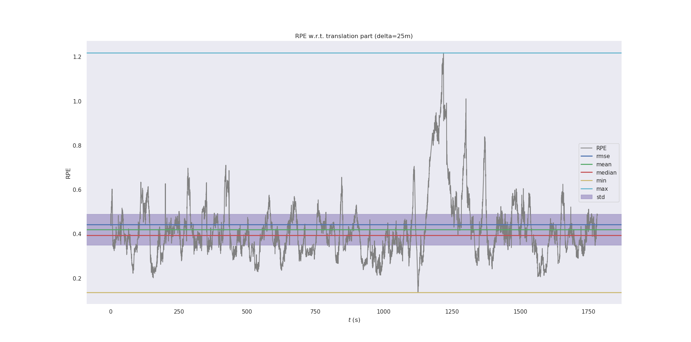
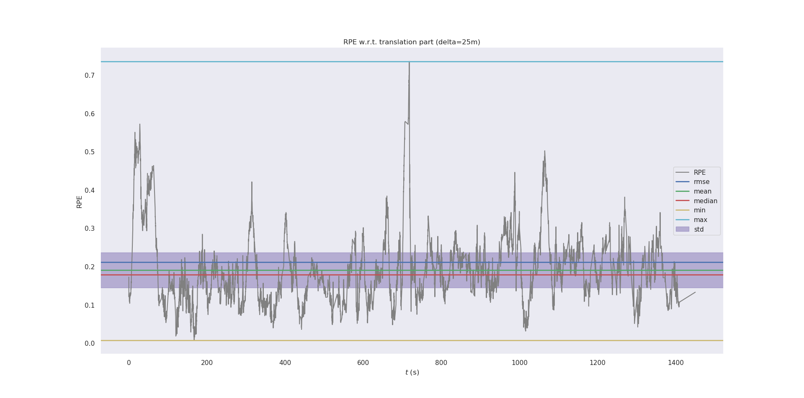

# IMU与里程计的EKF组合(右乘模型)

IMU递推和误差模型参考：[FAST-LIO公式推导](https://zhuanlan.zhihu.com/p/561877392)

|  | 01 | 02 |
| :----------------------------------: | :------------------------------: | :------------------------------: |
|                 估计轨迹与参考轨迹                 |                                  |      |
| 25米位置相对精度 |  |  |
| APE & RPE | APE: 5.564, 12.127 RPE(25m): 0.49 / 1.76% RPE(50m): 0.85 / 1.78% RPE(100m): 1.57 / 1.95% RPE(200m): 3.00 / 2.42% | APE: 1.801, 5.312 RPE(25m): 0.37 / 0.84% RPE(50m): 0.53 / 0.86% RPE(100m): 0.80 / 0.97% RPE(200m): 1.24 / 1.30% |

